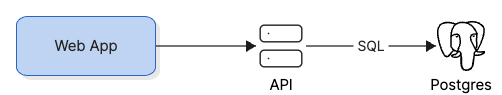
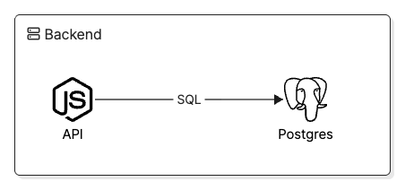

# Getting Started with Eraser Diagrams

Eraser Diagrams turns diagram JSON into rendered PNG or HTML output — or hands the measured diagram back as JSON. A diagram is a JSON document of tagged elements; Eraser Diagrams validates it, resolves icons and fonts, renders and measures it in Chromium, routes connections against the measured geometry, and produces the output you asked for.

The fastest way to try it is the CLI. For application integrations, the same functionality is available through the Node API.

## Requirements

- **Node.js 22.12 or newer.**
- **A Chromium-family browser.** Eraser Diagrams does not install or bundle one. Locally, an installed Google Chrome works. In containers, CI, or serverless environments, use the Chromium distribution appropriate for that environment (or the one your app already ships with Puppeteer or Playwright).
- **Network access** at render time if you use Eraser's hosted icon catalog or remotely hosted fonts.

## Install

```bash
npm install @eraserlabs/diagrams        # Node API
npm install -D @eraserlabs/diagrams-cli # eraser-diagrams command
```

`@eraserlabs/diagrams` is the Node API. [`@eraserlabs/diagrams-cli`](./packages/diagrams-cli/README.md) provides the `eraser-diagrams` command.

## Your first diagram

Create `diagram.json`:

```json
{
  "entities": [
    {
      "tag": "Shape",
      "id": "web",
      "shape": "rectangle",
      "x": 40,
      "y": 60,
      "width": 140,
      "height": 60,
      "color": "blue",
      "texts": [{ "text": "Web App" }]
    },
    {
      "tag": "Icon",
      "id": "api",
      "icon": "server",
      "size": "md",
      "x": 280,
      "y": 65,
      "texts": [{ "text": "API" }]
    },
    {
      "tag": "Icon",
      "id": "db",
      "icon": "postgres",
      "size": "md",
      "x": 460,
      "y": 65,
      "texts": [{ "text": "Postgres" }]
    }
  ],
  "connections": [
    { "from": "web", "to": "api", "endArrowhead": "triangle" },
    { "from": "api", "to": "db", "endArrowhead": "triangle", "label": "SQL" }
  ]
}
```

A connection needs no `tag` and no `id` — anything in `connections` is a `Relationship` unless it says otherwise, and identities are assigned for you.

Render it, pointing at a Chromium executable. On macOS with Chrome installed:

```bash
npx eraser-diagrams render diagram.json \
  --chromium-path "/Applications/Google Chrome.app/Contents/MacOS/Google Chrome" \
  -o diagram.png
```

On Linux the executable is typically `/usr/bin/chromium`, `/usr/bin/chromium-browser`, or `/usr/bin/google-chrome`.

The CLI prints one status line per input and exits `0`:

```text
ok    diagram.json  → diagram.png  412 ms
```



The Chromium path can also come from the `CHROMIUM_PATH` environment variable or from a config file, and when none of those is set the CLI probes the usual install locations and tells you which one it picked. Precedence is `--chromium-path`, then `CHROMIUM_PATH`, then the config file, then auto-detect.

## Configuration file

For repeated use, put stable settings in a config file instead of repeating flags. `eraser-diagrams init` writes one with the Chromium it found (`--chromium-path`, then `CHROMIUM_PATH`, then auto-detect; `--force` overwrites an existing file):

`eraser-diagrams.config.json`:

```json
{
  "chromiumPath": "/Applications/Google Chrome.app/Contents/MacOS/Google Chrome"
}
```

The CLI picks up the nearest `eraser-diagrams.config.json` at or above the current directory automatically — the search stops at the first directory containing `.git`, so a config in one repository is never picked up from another. `--config <path>` or `ERASER_DIAGRAMS_CONFIG` names one explicitly, and `--no-config` skips discovery entirely. From then on:

```bash
npx eraser-diagrams render diagram.json -o diagram.png
```

Flags override environment variables, which override the config file. The config file accepts:

| Key | Meaning |
| --- | --- |
| `chromiumPath` | Path to the Chromium executable used for rendering. |
| `format`, `outDir`, `deviceScaleFactor`, `pages` | Defaults for `--format`, `--out-dir`, `--scale`, `--pages`. |
| `icons` | `{ baseUrl, cacheDir, timeoutMs, cacheTtlMs, onUnknown }` — icon host, on-disk cache, and unknown-icon policy (see [Icons](#icons)). |
| `fonts` | Font configuration, inline or as a path to a JSON file (see [Fonts](#fonts)). |
| `library`, `overrides` | Module paths for a custom component library or component overrides (see [Customization](#customizing-eraser-diagrams)). |
| `failOnWarning` | Default for `--fail-on-warning`. |
| `$schema` | Optional JSON Schema reference for editor completion; ignored by the CLI. |

Unknown keys are rejected rather than ignored, so a typo fails the invocation instead of silently doing nothing.

The full key reference is in the [CLI README](./packages/diagrams-cli/README.md#configuration-file).

## Outputs

### CLI reference

```text
eraser-diagrams render <input...>   [-o out | --out-dir dir] [--format png|html] [--scale n] [--pages n]
                                    [--chromium-path path] [--json] [--fail-on-warning] [--debug] [-q]
                                    [--config path | --no-config]
eraser-diagrams validate <input...> [--json] [--fail-on-warning] [--debug] [-q]
eraser-diagrams registry            # tag registry as JSON
eraser-diagrams schema <tag>        # one tag's JSON Schema
eraser-diagrams init [--force]      # write eraser-diagrams.config.json
```

Passing `-` as the input reads the diagram from stdin, which is convenient when another program generates the JSON. Several inputs render through one warm browser; `-o -` streams the bytes to stdout. Every flag is listed in the [CLI README](./packages/diagrams-cli/README.md).

A third output — the measured diagram as JSON — is currently available through the Node API only; see [Requesting outputs](#requesting-outputs).

### PNG

PNG is the default format. Use it anywhere the diagram should behave like an ordinary image: Slack, documents, presentations, generated reports.

```bash
npx eraser-diagrams render diagram.json -o diagram.png
```

### HTML

`--format html` produces a standalone HTML document — the browser-native representation of the diagram. Fonts are referenced by their configured source; set `inline: true` on a `file` or `file-from-url` face to embed bytes.

```bash
npx eraser-diagrams render diagram.json --format html -o diagram.html
```

### Diagnostics

Problems are reported per input on stderr. Warnings do not fail the render; errors do, and the CLI exits `1` without writing that output. Misspelling an icon name in the first-diagram example, say, produces:

```text
ok    diagram.json  → diagram.png  412 ms  1 warning
  warning W_UNKNOWN_ICON /entities/2/icon (Icon#db) — Unknown icon "postgress"; using a placeholder glyph.
```

With `--json` the same information is one JSON report on stdout — `{ ok, degradedFonts, results: [{ input, out, ok, errors, warnings, ms }] }` — where each issue carries a stable `code`, a JSON Pointer `path` into your input, and the element index and tag, so both programs and LLMs can act on the feedback and revise the diagram. (`out` is absent when the bytes went to stdout; `--debug` adds a per-result `timingsMs`.)

Exit codes: `0` success, `1` at least one input failed, `2` the invocation itself failed — a bad flag, a bad config, no Chromium, an unusable `-o` combination, or a custom library that would not load. `--debug` prints a per-stage timing table to stderr.

## The diagram format

Every element has a `tag` that selects its component — a schema plus its markup and CSS (connections in the split form may omit it; see below). There are two kinds of elements:

- **Entities** are visual components: shapes, icons, groups, text. Entities require an `id` plus `x` and `y` coordinates. `width` and `height` are optional _minimums_ — content, padding, and fonts can grow the rendered element beyond them, and rendered dimensions are measured in the browser.
- **Connections** link two entities: `from` and `to` reference entity `id`s. Connections are routed automatically around obstacles unless you author an explicit route.

Coordinates are non-negative, integer pixel values with the origin at the top left.

### The document form

A diagram is a document with an `entities` list and a `connections` list:

```jsonc
{
  "entities": [
    {
      "tag": "Shape",
      "id": "api",
      "x": 40,
      "y": 40,
      "texts": [{ "text": "API" }],
    },
    { "tag": "Shape", "id": "db", "x": 280, "y": 40, "shape": "cylinder" },
  ],
  "connections": [{ "from": "api", "to": "db" }],
}
```

In `connections`, `tag` is optional — an untagged connection is a `Relationship` (the library's declared default connection tag) — and so is `id`. A connection at its most common is exactly `{ "from": "a", "to": "b" }`, which is deliberate: when an LLM emits a diagram, every omitted `"tag": "Relationship"` and `"id"` is tokens saved.

The form requires **both** keys. `"connections": []` is the whole point of it: a diagram with no edges says so, instead of leaving a reader (or a model) to wonder whether the connections were forgotten. Supplying only one of the two keys is an error.

One other form is accepted — a single interleaved `{ "elements": [...] }` list, which requires `tag` on every element since the list asserts no kind. The full input grammar lives in the [resolve README](./packages/resolve/README.md).

An element whose tag is declared as a connection cannot sit in `entities` (or vice versa) — the tag registry is the authority on kind, and a misfiled element is an `E_KIND_MISMATCH` error rather than a silent reclassification.

`outputs` is reserved for the render call (below), so a complete render request also validates cleanly. Any other top-level key is ignored with a `W_UNKNOWN_KEY` warning.

Issue paths point into the document as you submitted it, rooted at the key that named the list: `/elements/3/texts/0/text`, `/entities/3/…`, or `/connections/0/…`.

TypeScript callers can pin the shape at compile time:

```ts
import type { DiagramInput } from '@eraserlabs/diagrams';

const diagram = {
  entities: [{ tag: 'Shape', id: 'api', x: 40, y: 40 }],
  connections: [],
} satisfies DiagramInput;
```

`DiagramInput` is a strict union of the two envelope forms — it will not let you write `entities` without `connections`, and it will not let you mix the forms.`AuthoredEntity`, `AuthoredConnection`, and `AuthoredElement` are exported alongside it.

### Stock tags

| Tag | Kind | What it draws |
| --- | --- | --- |
| `Shape` | entity | Geometric node (`rectangle`, `diamond`, `cylinder`, `hexagon`, `circle`, `ellipse`, `oval`, `parallelogram`, `trapezoid`, `triangle`, `document`, `star`) with text and an optional icon. |
| `Icon` | entity | An icon with caption text. Sizes: `sm` (32px), `md` (50px), `lg` (72px), `xl` (100px); for exact dimensions, author `width`/`height`, which take precedence over the preset. |
| `Activity` | entity | BPMN task: a rounded rectangle with an optional `icon` to the left of its centered `texts` (the Shape side-icon model); author `badge` for a corner chip instead. |
| `Event` | entity | BPMN event: a 56px circle with an optional `icon` inside and its `texts` label below. |
| `Gateway` | entity | BPMN gateway: a 56px diamond with an optional decision `icon` (`x` for exclusive) and its `texts` label below. |
| `Textbox` | entity | Standalone markdown text. |
| `Group` | entity | Container with an optional title band; other entities join it via `containerId`. |
| `Lane` / `Pool` | entity | Swimlane containers; their titles render as full-height vertical bands on the left edge (BPMN style). |
| `Divider` | entity | Horizontal or vertical divider line. |
| `DatabaseTable` | entity | Table with named, typed fields. |
| `Legend` | entity | Key explaining the diagram's visual grammar: `entries` is a flat list of `{ text, color? }` rows, each painting a swatch beside its line. |
| `Badge` | sub-template | Small badge mounted on other elements via their `badge` property; not a standalone element. |
| `Relationship` | connection | Line between two entities with optional label, arrowheads, and ports. |
| `DatabaseRelationship` | connection | Database relation: `relType` (`one-to-one`, `one-to-many`, `many-to-one`, `many-to-many`) picks the crow's-foot arrowhead pair. |

The authoritative reference for each tag is its schema, in [`packages/diagrams/src/library/templates/`](./packages/diagrams/src/library/templates/) — for example [`Shape.schema.ts`](./packages/diagrams/src/library/templates/Shape/Shape.schema.ts), [`Icon.schema.ts`](./packages/diagrams/src/library/templates/Icon/Icon.schema.ts), [`Group.schema.ts`](./packages/diagrams/src/library/templates/Group/Group.schema.ts), and [`Relationship.schema.ts`](./packages/diagrams/src/library/templates/Relationship/Relationship.schema.ts). The shared enums (shapes, arrowheads, ports, typefaces, and so on) live in [`enums.ts`](./packages/diagrams/src/library/schema/enums.ts). Machine-readable JSON Schemas for all three document forms ship with [`@eraserlabs/protocol`](./packages/protocol/), and the Node API exposes every tag's compiled schema at runtime through `tagSchema(tag)` and `registryInfo()`.

### Common properties

Entity properties shared across stock tags:

| Property | Type | Notes |
| --- | --- | --- |
| `tag`, `id` | string | Required. |
| `x`, `y` | number | Required. Top-left position. |
| `width`, `height` | number | Optional minimum dimensions. |
| `containerId` | string \| null | Id of the `Group`/`Lane`/`Pool` this entity belongs to. |
| `texts` | array of text runs | On `Shape` and `Icon`. Each run: `{ text, fontSize?, color?, hAlign?, typeface? }`. Text is markdown; a run's `color` is a raw CSS color. |
| `color` | string | On `Shape`, `Group`, `Lane`, `Pool`, `DatabaseTable`, `Legend` and `Divider`, the element's identity color: a palette token (`white`, `yellow`, `green`, `blue`, `purple`, `red`, `orange`, `black`) or any CSS color (`"#4a6fa5"`, `"peachpuff"`, `"rgb(30 30 30)"`). One value drives the whole coordinated look — pastel body, hairline, container tint, badge background, title surface — and a raw color gets exactly the same treatment a token does. A string that is neither a token nor a valid CSS color is an error with a did-you-mean. On `Icon` and `Textbox` `color` is instead the text/glyph ink and takes a raw CSS color only. |
| `bgColor`, `borderColor` | string | Raw CSS colors only, naming one surface each; they override what `color` would have painted there. Palette token names are not accepted here (`"red"` is the CSS color red, not the palette identity). |
| `styleMode` | string | Visual treatment: `plain`, `shadow`, or `watercolor`. On the surface-bearing tags (`Shape`, `Group`, `Lane`, `Pool`, `DatabaseTable`, `Legend`). Omitted, the tag schema fills `shadow`. |
| `cornerRadius`, `borderStyle`, `borderWidth` | — | Same tags as `styleMode`: corner treatment (`round`, `sharp`, or four radii), `solid`/`dashed`/`dotted`, and stroke width. |
| `icon` | string | Icon by catalog name (see [Icons](#icons)); `iconProps` (`{ color, size }`) styles it. |
| `fontSize` | number (px) | Exact pixels, re-basing every text run on the element. Omit it and each slot keeps its own default (primary text 15, secondary 12, group title 16, `DatabaseTable` 17). |
| `typeface` | string | `rough`, `clean`, or `mono`. On `Icon`, `Textbox`, `DatabaseTable`, and `Divider`. Not on `Shape` — set `texts[].typeface` per run instead. |
| `badge` | object | Badge mounted on the element. |

On `Lane` and `Pool` the title renders as a vertical band on the container's left edge, reading bottom-up — the standard BPMN pool/lane form; `Group` keeps its horizontal chip. `Group`, `Lane`, and `Pool` carry their text in a `title` object (`{ text, icon, iconProps, width, bgColor, border, color, fontSize, hAlign, typeface }`), so the title's size and typeface are authored as `title.fontSize` and `title.typeface` rather than at the element root. A present `title` that omits `width` defaults per tag: `Group` gets the snug chip (`width: "snug"`), `Lane` and `Pool` get the full-height band (`width: "full"`); `border` defaults to `true` everywhere. Set `width` explicitly for the other treatments — `"snug"` hugs the text, `"full"` spans the container, `"none"` is plain text (no chrome) — or `border: false` to keep the slot without a line. An omitted `title` object is not invented.

Connection (`Relationship`) properties:

| Property | Type | Notes |
| --- | --- | --- |
| `tag`, `id` | string | Both optional in `connections`: an untagged connection is a `Relationship`, and identities are assigned deterministically. |
| `from`, `to` | string | Required. Entity ids. |
| `label` | string | Inline-markdown line label. |
| `startArrowhead`, `endArrowhead` | string \| null | `arrow`, `bar`, `dot`, `triangle`, `crowFootSingle`, `crowFootMany`. An absent `startArrowhead` means no arrowhead; an absent `endArrowhead` on a `Relationship` defaults to `triangle`. Pass `null` to opt out of that default. (On a `DatabaseRelationship` an absent pair comes from `relType`.) |
| `fromPort`, `toPort` | string | Pin an endpoint to a side: `top`, `right`, `bottom`, `left`. |
| `connectorStyle` | string | How the route travels: `elbow` (orthogonal segments, default) or `straight` (one direct line between the shapes). |
| `cornerStyle` | string | How route corners are painted: `elbow` (rounded, default) or `straight` (square). |
| `lineStyle`, `lineWidth`, `color` | string / number / string | `solid`/`dashed`/`dotted`, stroke width, stroke color (a palette token or any CSS color, as above). |
| `fontSize`, `typeface` | number (px) / string | Label size in exact pixels (omitted, the label renders at its 14px default) and `rough`/`clean`/`mono`. |
| `badge` | object | Badge mounted on the line; `placement` additionally accepts `start`, `middle`, and `end`. |
| `points` | array | Explicit route as at least two `{x, y}` waypoints, when you want to author the path instead of using the router. |

### Containment

Groups establish structure, not just visuals: containment is authored with `containerId`, and routing and layout respect it.

```json
{
  "entities": [
    {
      "tag": "Group",
      "id": "backend",
      "title": { "text": "Backend", "icon": "server" },
      "x": 40,
      "y": 40,
      "width": 420,
      "height": 180
    },
    {
      "tag": "Icon",
      "id": "api",
      "icon": "node",
      "size": "md",
      "x": 80,
      "y": 110,
      "containerId": "backend",
      "texts": [{ "text": "API" }]
    },
    {
      "tag": "Icon",
      "id": "db",
      "icon": "postgres",
      "size": "md",
      "x": 340,
      "y": 110,
      "containerId": "backend",
      "texts": [{ "text": "Postgres" }]
    }
  ],
  "connections": [
    { "from": "api", "to": "db", "endArrowhead": "triangle", "label": "SQL" }
  ]
}
```



## Icons

Icons are referenced by name, not by pasting SVG:

```json
{ "tag": "Icon", "id": "db", "icon": "postgres", "x": 40, "y": 40 }
```

Names resolve against Eraser's hosted catalog of thousands of technology and diagramming icons — `postgres`, `server`, `node`, `react`, `docker`, `kubernetes`, `redis`, `aws-lambda`, `user`, `globe`, and so on. An icon name `foo` fetches `<baseUrl>/foo.svg`; the default base URL is Eraser's public asset bucket, so rendering with stock icons requires network access. Unknown names render as a placeholder glyph and produce a `W_UNKNOWN_ICON` warning naming the element and path.

For custom or offline icons, set `icons.baseUrl` (and optionally `icons.cacheDir` for disk caching) in the CLI config, or pass your own `iconLoader` to the Node API. `icons.onUnknown: "error"` in the CLI config (`onUnknownIcon: 'error'` in the Node API) turns unknown icons into hard failures instead of placeholders.

## Fonts

Eraser's stock fonts are used by default. Custom fonts are supplied through the `fonts` configuration (CLI config file or `createRenderer` option). How a face is sourced decides both render-time loading and what HTML output references:

- `file` and `file-from-url` — read from disk (after a one-time fetch into `cachePath` for `file-from-url`) for measurement and PNG. HTML output references the file path or the original URL unless you set `inline: true` to embed bytes as a data URI.
- `url` — Chromium loads the font over the network at render time, and HTML output references the same URL. Requires network.
- `system` — the host-installed family; metrics may differ across machines.

Font metrics affect text wrapping, measured element dimensions, and therefore routing. For reproducible output, use `file` or `file-from-url`. `url` means network at render time and a URL in the output. `system` may differ across machines.

## Using the Node API

The CLI is a thin wrapper around the Node API. Applications call `createRenderer` once to boot Chromium and prepare pages, then render as many diagrams as they like against the warm instance:

```ts
import { createRenderer } from '@eraserlabs/diagrams';

const renderer = await createRenderer({
  chromiumPath: process.env.CHROMIUM_PATH!,
});

const outcome = await renderer.render({ entities, connections });

if (outcome.ok) {
  await writeFile('diagram.png', outcome.png); // outcome.warnings, outcome.timingsMs
} else {
  console.error(outcome.errors);
}

await renderer.close();
```

### Requesting outputs

`render` takes exactly one argument: the diagram, with the outputs you want under a reserved `outputs` key — independent flags, all produced from a single resolve + browser pass. Omit `outputs` and you get whatever the renderer was created with, which defaults to a PNG.

```ts
const outcome = await renderer.render({
  entities,
  connections,
  outputs: { png: true, json: true },
});

if (outcome.ok) {
  outcome.png; // Buffer — the raster screenshot
  outcome.json; // the measured diagram as data
}
```

- `png` — raster screenshot of the scene (`Buffer`).
- `html` — standalone HTML document; fonts are referenced by source unless a file face sets `inline` (`string`).
- `json` — the diagram as data, in the split form: `{ entities, connections, scene }`. **It is your submitted document verbatim, plus measured geometry — nothing else.** Every element comes back with the properties and values you wrote (a palette token is still `"blue"`, `size` is still `"md"`, a connection you gave no `id` still has none), with only the overlay written on top: entity `x`/`y`/`width`/`height` are the final rendered boxes, connections carry their routed `points` and placed `labelPlacement`, and `scene` is the overall bounding box. Nothing the library interpreted — a resolved color, a derived property, a defaulted field — is baked in, so the document keeps working after you edit the palette or a component and hand the same JSON back. The result is itself a valid document — render it again, or hand it to an LLM to inspect actual dimensions, spot overlaps, and revise.

An explicit `outputs: {}` produces no outputs at all: the full pipeline runs and you get back the `warnings` and `timingsMs` alone, which is the cheap way to check a diagram for problems that only surface once it is measured.

The result type mirrors the request: ask for `outputs: { png: true, json: true }` and TypeScript knows `outcome.png` and `outcome.json` are present.

A request's `outputs` replaces the renderer's default wholesale — the two are never merged flag by flag.

`createRenderer` options beyond `chromiumPath`:

| Option | Meaning |
| --- | --- |
| `browser` | Instead of `chromiumPath`: a `() => Promise<Browser>` provider, e.g. `chromium.connectOverCDP(wsUrl)` for a remote browser fleet. |
| `pages` | Warm page pool size for concurrent renders (default 1). |
| `deviceScaleFactor` | Pixel density of PNG output (default 1; use 2 for retina-quality images). |
| `fonts` | Custom font configuration. |
| `outputs` | Default output flags for requests that omit `outputs` (default `{ png: true }`). |
| `iconLoader`, `onUnknownIcon` | See [Icons](#icons). |
| `library`, `overrides`, `normalizers` | Custom visual vocabulary (defaults to the stock library); see [Customization](#customizing-eraser-diagrams). |

The handle also exposes:

- `validate(document)` — full validation of any accepted input form, without touching the browser;
- `tagSchema(tag)` — the compiled JSON Schema for one tag;
- `registryInfo()` — every registered tag with its kind, whether it is a container, and schema, useful for handing an LLM the exact authoring vocabulary;
- `close()` — shuts down the browser. Always call it (or reuse the instance for the process lifetime).

## Using Eraser Diagrams in CI

The CLI is the simplest CI integration. A typical job installs dependencies, makes Chromium available (`CHROMIUM_PATH`), and renders:

```bash
npx eraser-diagrams render diagrams/*.json --out-dir artifacts --fail-on-warning
```

The input is ordinary JSON, so earlier steps in the job — scripts, code generators, LLMs — can produce or modify it without access to a browser. Only the render step needs Chromium. A failed render exits non-zero with the errors on stderr (or a JSON report on stdout with `--json`), which fails the job.

## Using Eraser Diagrams in a server

If Eraser Diagrams is part of an existing Node service, import `@eraserlabs/diagrams` directly: call `createRenderer` at startup, render per request, and set `pages` to allow concurrent renders. There is no need to run a separate rendering service.

For an all-in-one HTTP service, the repository includes [`@eraserlabs/server`](./packages/server/), a thin Fastify wrapper exposing `/render`, `/validate`, `/registry`, and `/health`. It works standalone and doubles as example code for building your own service around the API.

## Serverless and Lambda

The Node API works in Lambda and similar environments. The one extra consideration is Chromium: use a distribution built for your platform (for example `@sparticuz/chromium` on Lambda) and pass its executable path as `chromiumPath`, or connect to a remote browser service via the `browser` provider. Keep the `createRenderer` instance alive across warm invocations rather than booting Chromium per request.

## Customizing Eraser Diagrams

The stock components, styles, icons, validation, and routing are a complete diagramming system — no customization is required to use it.

When you outgrow the defaults, you can override stock components, define your own tags with their own components (variants, states, and data-driven styling included), and supply your own icons and fonts. See [CUSTOMIZATION.md](./CUSTOMIZATION.md).

## Next steps

- Read the [README](./README.md) for the design principles behind Eraser Diagrams.
- Read [CUSTOMIZATION.md](./CUSTOMIZATION.md) to define your own components, variants, and visual system.
- Read the [Model Diagramming Protocol spec](./packages/protocol/SPEC.md) for the underlying contracts.
- Working on Eraser Diagrams itself? The repository includes a [local playground](./packages/playground/README.md) for exploring fixtures, schemas, and rendering in the browser.
