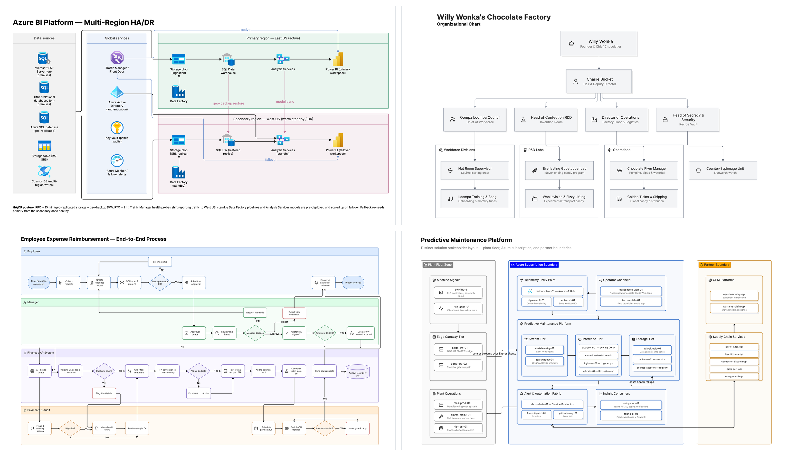

# Eraser Diagrams

Eraser Diagrams is an open-source diagramming system for creating clear, consistent, beautiful diagrams that you'd be proud to put in front of your customers, colleagues, or board. Created with ❤️ by [Eraser](https://eraser.io)

It is designed to be maximally useful for LLMs/agents and for maximum portability.

Use Eraser Diagrams when you want:

- An end-to-end diagramming framework (components, icons, line routing, and PNG generation built-in)
- The ability to define your team's defaults, components, and styles
- A system that works in any environment (build a Slackbot, a CI tool, or use it directly in your agent of choice)

To create your first diagram, see [Getting Started](./GETTING_STARTED.md). The rest of this README explains the principles behind the system, the tradeoff it makes, and how its parts fit together.

# Why we built this, or a diagramming system from first principles

The rapid improvement of LLMs has made it clear that hand-drawing diagrams is a thing of the past. Less clear is how to create a framework to best leverage these capabilities. We went to the drawing board and started from square one.

## What makes a good diagram?

As they say, a picture is worth a thousand words, and a good diagram is just as valuable. But how are diagrams able to condense information so effectively?

- They visually communicate a **structured narrative** through the use of **relationships and hierarchies**. Connections (arrows) between elements, containment (an element inside of a group), and layout choices are critical for establishing the narrative before a viewer has even read a word.
- Diagrams are highly **templated**. Flowcharts, architecture diagrams, swimlane diagrams and so forth each have their own general conventions. Teams, organizations, and disciplines will often invent their own specialized conventions. Conformance with these is critical to help a viewer jump beyond the "what is this" stage and directly into the story.
- Good diagrams **balance repetition and variation**. If everything in a diagram looks the same except the labels, we may as well write a bulleted list. If everything changes between each node, there's no pattern. Consistency of a visual grammar (colors, borders, line types, badges, text and icon layout, and so forth), both within and between diagrams, aids rather than distracts.
- **Iconography** is one of the most important parts of the visual grammar. It is a picture-within-a-picture and can save a lot of additional text.
- From time to time, a diagram may need to break conventions or produce a unique visual to communicate effectively.

## What features should a diagramming framework have?

- **Familiar as can be**: Property names, technologies, and concepts should be self-documenting or extremely familiar by analogy with prior art. We want to teach as little as possible.

- **Batteries included**: Diagrams want icons. Lines need routing. Users want PNGs. All of this should work without needing to write additional code and with as few dependencies or requirements as possible.

- **Run anywhere**: Freed from needing to draw diagrams by hand, we'll be wanting to create them everywhere. It should be possible to run in as many environments as possible to enable CI jobs, slackbots, internal tools and more.

- **Customizable from the ground up**: If you only want to allow certain colors, that should be possible. If you want to bundle visual settings into a few variants the LLM can pick from, that should be possible. Have a font or icons you like? Great. Your brand, your diagram, your stories.

- **Separate the diagram from the visual system**: What makes a diagram specific is the data, process, or system it communicates. How to draw a node should not be learned on every request. Variants, components, schemas, and color palettes should not be decided on a diagram-by-diagram basis. This makes each individual diagram concise for LLMs to express while enforcing style guides by construction, not by prompt engineering.

- **Offer progressive control**: In the basic case, declaring "connect A to B", using automatic dimensions, and specifying few or no visual properties should suffice to generate a simple, reasonable diagram. But leveraging the continued growth of LLMs requires exposing all of the primitives. Line routing, custom visuals, deliberately overlapping geometries - all must be possible. The expressive ceiling should not be designed around the limitations of weaker models.

- **Resolve authored intent into measured reality.** Authored geometry and rendered geometry are different concepts. Components, fonts, wrapping, padding, and borders affect physical bounds. Routing and finalized images should account for the actual dimensions, not just an LLM's initial guess.

- **Produce data, not just pixels.** Applications and LLMs may want to manipulate, introspect, validate, save, or update the resolved outputs before, after, or in addition to displaying the visual output.

- **Support extension.** Today, our goal is to allow users to create the same diagrams they might in a dedicated tool like Visio or LucidChart. But as LLMs progress, it will unlock new possibilities. Our system should build on foundations that support interactivity, animations, navigation, and more.

## Eraser's framework

To achieve those features, we decided on the following approach:

- **JSON as the diagram definition**: It is easy to construct, parse, edit and transport in virtually any environment. There is a mature ecosystem of tools like JSON Schema to define schemas and validate requests. It is reasonably concise (token efficient), which makes it reasonable to use directly as the format that LLMs directly operate on. From a security perspective, JSON is also inert by default, which reduces the risk of it touching the browser or network before sanitization is run.
- **HTML and CSS as the visual substrate**: HTML (including SVG) is extremely powerful and flexible. It supports interactions, animations, and navigation. CSS variables and data properties allow for a clean hand-off from JSON to component-backed rendering engine. SVGs are sufficient to support lines and custom visuals.
- **A minimal templating engine**: Component markup should be sophisticated enough to allow familiar concepts from front end frameworks, such as conditional rendering, iteration, composition, slots, and access to structured data without also supporting arbitrary code execution.
- **Explicit hand-off from data to rendering engine**: Each entity should explicitly provide a `tag`. Each `tag` should map to one component: a schema plus its markup and CSS. The schema defines the shape of the expected data, the component defines the visual output.
- **Everything is editable**: The measured diagram comes back as the authored document plus its rendered geometry, so a generated diagram stays a document. People and programs can move, restyle, and reconnect it and hand it straight back for another render.

We believe that the following primitives and concepts are important enough in diagrams to provide explicit first-class recognition and support:

- **Icons should be specified by name**: A schema can specify which fields are icons. An icon is specified like `"user"` or `"aws-s3"`, not a fully formed SVG.
- **Groups and containment**. Structural hierarchies should not be inferred from geometry. Authored containment is critical to properly do routing, layout, and rendering.
- **Connections and entities are not the same**. A connection is not merely a different tag and not merely a line. Connections go from one entity to another and should be treated as such.
- **Line routing and text wrapping can be subjective**. Eraser provides control over these behaviors.

# The alternatives

There are other approaches we could have taken, and that you might take if tasked with building a diagramming tool from scratch. None of the alternatives below are bad technologies. Eraser Diagrams itself is built heavily on existing web standards. The question is which layer should own diagram semantics, visual consistency, and final composition.

## Direct-to-SVG (or HTML)

HTML and SVG are expressive, portable, and deeply familiar to LLMs. They are excellent choices when the desired result is one bespoke rendered artifact.

But if every request contains the complete HTML or SVG representation, the author repeatedly owns decisions that should often remain stable: component structure, typography, spacing, icon placement, variants, routing conventions, and organizational styling.

Because core diagramming concepts like connections and containment aren't cleanly modeled, edits that might be conceptually simple also need to be handled very explicitly and verbosely.

You can solve this by writing some code to fill in defaults and providing explicit instructions to an LLM.

## Editor-native formats

Formats such as draw.io XML have rich diagram models and mature graphical editors. They understand nodes, connections, groups, routing, and many other diagramming concepts. If the desired output is specifically an editable document for that editor, using frontier LLMs to produce that output directly is probably the best bet.

However, these formats were designed to be an internal implementation detail, not a concise layer for LLMs. This means they are relatively expensive to generate, are more likely to be error prone, and cannot easily be manipulated by less capable LLMs.

## Diagram DSLs

DSLs such as Mermaid, D2, or earlier-generation Eraser DSL optimize for semantic concision. They are inexpensive in tokens, easy to read and version, and can produce relatively large diagrams very quickly.

In exchange, the renderer owns more of the final composition. The author describes the graph and can, to some extent, influence layout, but generally does not control exact placement, dimensions, attachment points, routing, or arbitrary visual structure. That is an excellent tradeoff when semantic correctness matters more than exact visual composition, but an unacceptable tradeoff if the goal is to replace handmade professionally polished diagrams.

# How Eraser Diagrams is built

Eraser Diagrams ships as a complete system, and we recommend using the [`@eraserlabs/diagrams`](./packages/diagrams) Node API or the [`@eraserlabs/diagrams-cli`](./packages/diagrams-cli/README.md) command line.

For those curious to dig deeper, under the hood, our framework is split into several modular libraries and an implementation-agnostic model diagramming protocol that defines the basic concepts and contracts.

| Package | Responsibility |
| --- | --- |
| [`@eraserlabs/diagrams`](./packages/diagrams) | Supplies the stock Eraser profile and orchestrates resolution, Chromium, fonts, icons, rendering, HTML output, and image snapshots through the Node API. |
| [`@eraserlabs/diagrams-cli`](./packages/diagrams-cli/README.md) | The `eraser-diagrams` command: argument parsing, `eraser-diagrams.config.json`, batch rendering and reporting on top of `@eraserlabs/diagrams`. |
| [`@eraserlabs/resolve`](./packages/resolve/README.md) | Validates diagram data and profile definitions, resolves icons and other references, normalizes content, and prepares trusted renderer input. |
| [`@eraserlabs/render`](./packages/render/README.md) | Implements the HTML template fill, authoritative browser measurement, layout, and apply pipeline. See the [render contract](./packages/render/SPEC.md). |
| [`@eraserlabs/layout`](./packages/layout/README.md) | Provides geometry and obstacle-aware orthogonal connection routing, including nested and partial routing; depends only on `@eraserlabs/utils`. |
| [`@eraserlabs/protocol`](./packages/protocol/README.md) | The dependency-free reference distribution of MDP contracts, schema annotations, and machine-readable schemas. See the [MDP specification](./packages/protocol/SPEC.md). |
| [`@eraserlabs/utils`](./packages/utils) | Dependency-free helpers shared across the Eraser packages: phase timing, set helpers, and small type guards. |

Generated diagrams remain structured and editable throughout the pipeline. AI generation should be the beginning of the interaction, not the end: people and applications can move, resize, restyle, reconnect, and refine a diagram without abandoning its underlying model.

For installation and practical usage, continue to [Getting Started](./GETTING_STARTED.md).
